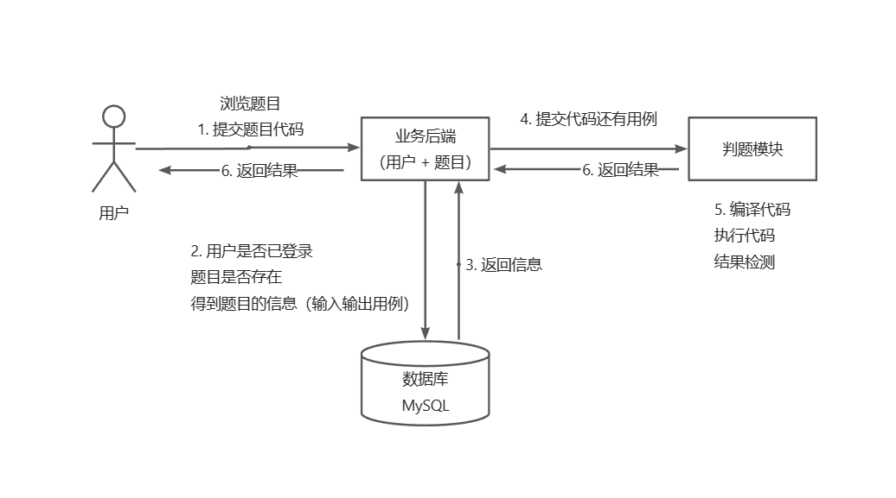

# LUOGUAN_OJ 项目

##### 实现核心

1、权限校验（前端、后端约定用户权限等级）

2、代码沙箱（安全沙箱）：

* 沙箱：隔离的、安全的环境，用户代码不会影响沙箱之外的系统运行。
* 安全：限制提交代码的危险行为执行：超时、内存溢出、读文件、写文件等。

3、判题模块：

* 根据语言，调用代码沙箱，获取结果与预先答案比对，得出答案

##### 核心业务流程

##### 技术选型

* 前端：Vue3 、Arco Design 组件库、[在线代码编辑器](https://github.com/microsoft/monaco-editor)、[MarkDown 文档编辑浏览](https://gihub.com/bytedance/bytemd)
* 后端：Spring Boot、Java 安全管理器、设计模式等

##### 项目目录

* luoguan-code-sandbox：代码沙箱项目：专注于执行用户提交的 Java 代码，返回执行的结果、时间等信息，同时进行安全限制处理。
* luoguan-oj：前端页面项目：完成基本的用户操作逻辑，登录、浏览、提交等业务场景。
* yuoj-backend-master：后端项目，链接数据库，提供普通的信息数据库增删改查功能，同时拓展判题模块，调用代码沙箱获取执行结果，进行结果比对再进行数据库操作以及更新前端代码。

##### 代码沙箱的技术选型

* 复用开源项目，使用相关的判题 API：judge0，通过 HTTP 调用接口自动编译执行用户程序并获取返回值。
* AI 当作代码沙箱，通过输入一段代码，指名参数，问其是否能获取预期的结果。
* 自主开发：
  * Java 原生实现：模拟调用 Java 命令行执行 Java 程序；其他程序需要相应编译器的命令（目前）
  * Docker 实现
